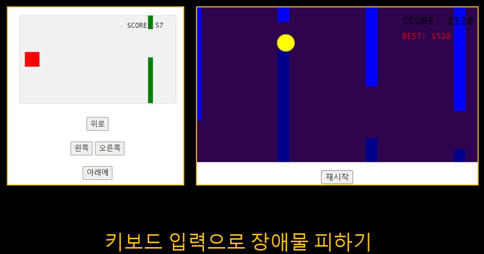
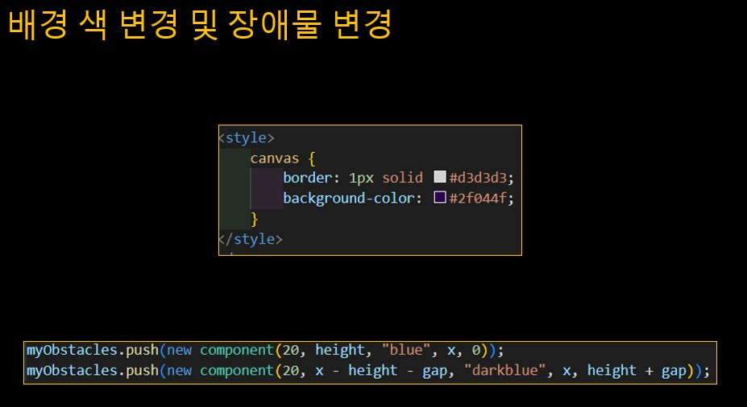
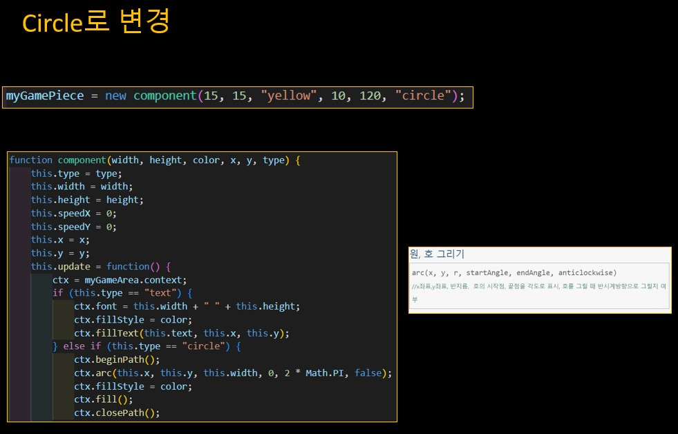
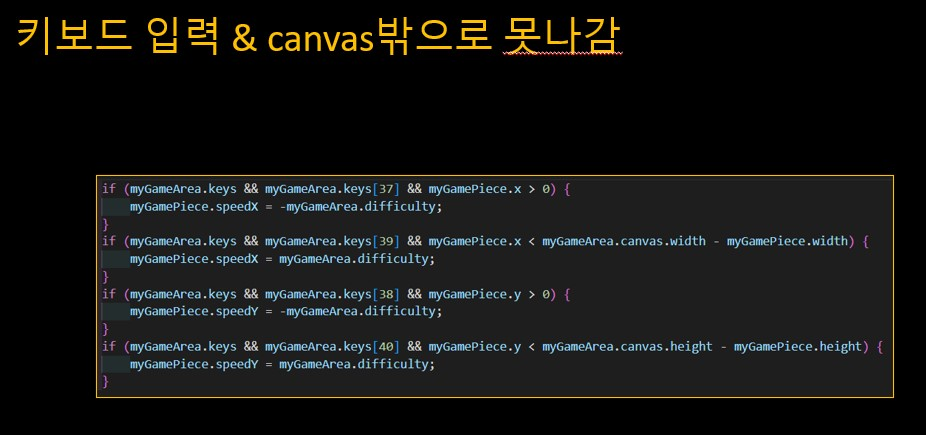
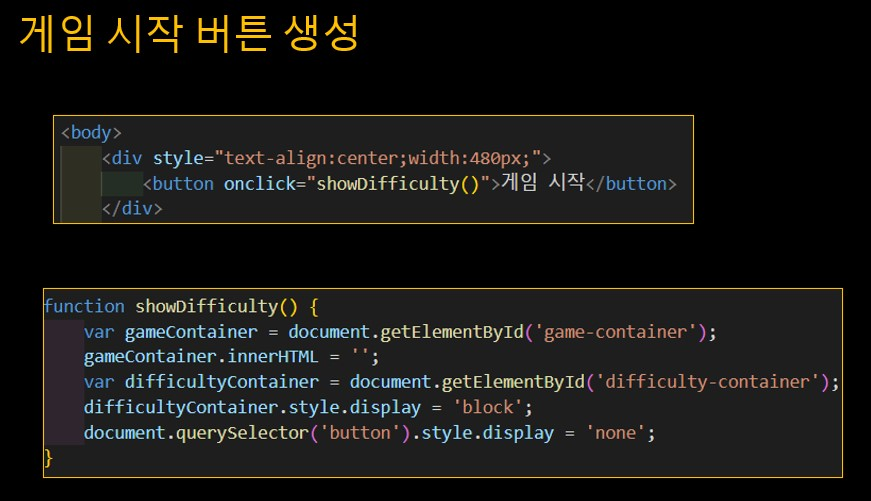
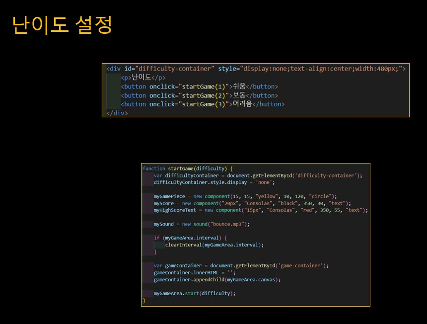
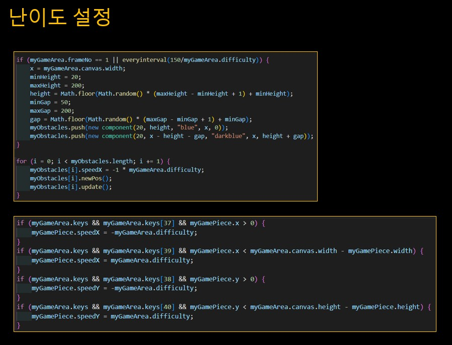
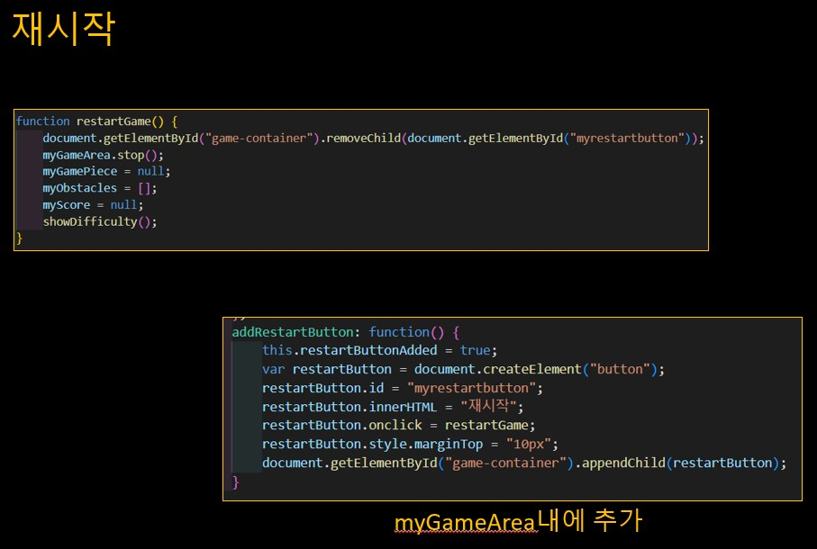
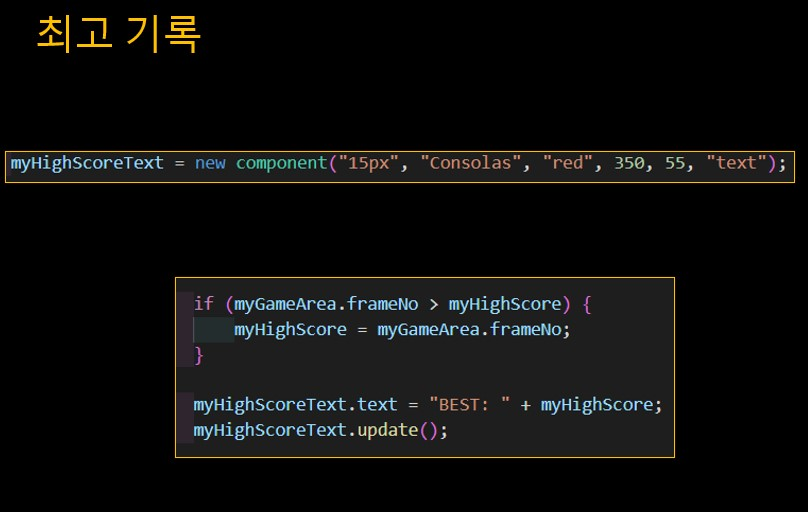

## 본래의 게임에서 업그레이드를 진행.
[]
## 먼저 색상들을 바꿔보았음.
[]
## arc를 이용해 사각형이었던 개체를 원으로 바꾸어보았음.
[]
## 버튼을 눌려야하는 방식에서 키보드 입력을 통해 이동하게 바꾸었고 개체를 canvas밖으로 못나가게함.
[]
## 게임시작 버튼을 눌러야 canvas가 나오게 함.
[]
## 난이도를 만들어 누르는 난이도에 따라 개체와 장애물 속도를 다르게 하여 차별성을 줌. difficulty를 이용해 속도를 조절하게 수정함.
[]
[]
## 재시작 버튼을 만들어서 게임이 충돌됨에 따라 재시작버튼이 나오고 누르면 다시 게임을 시작함.
[]
## HighScore을 만들어 최고기록을 출력하게 만듬. update를 통해 최고점수가 갱신됨에따라 유동적이게 변함.
[]
