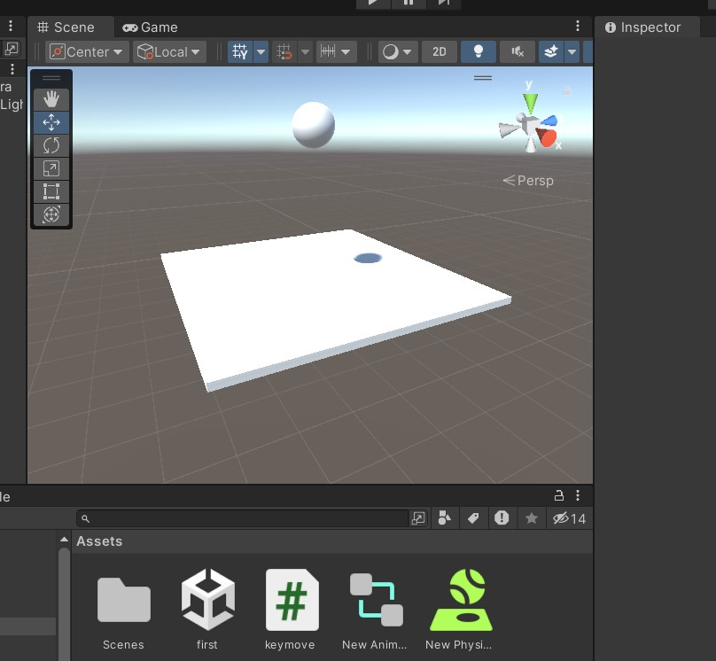
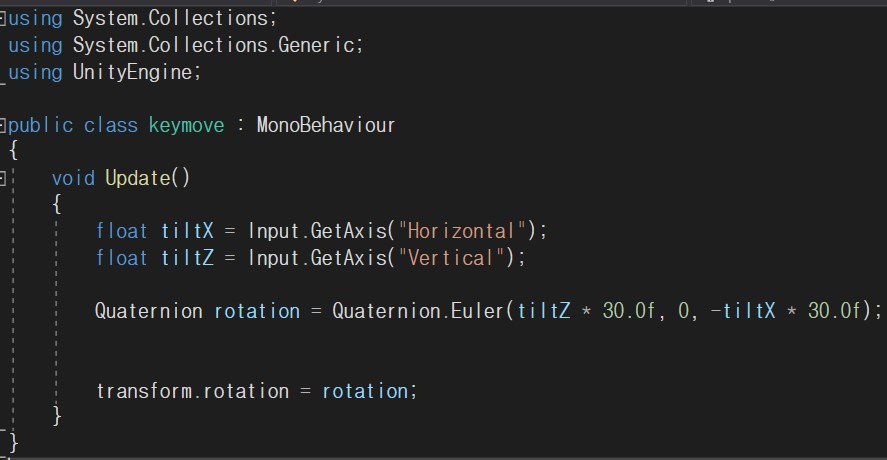
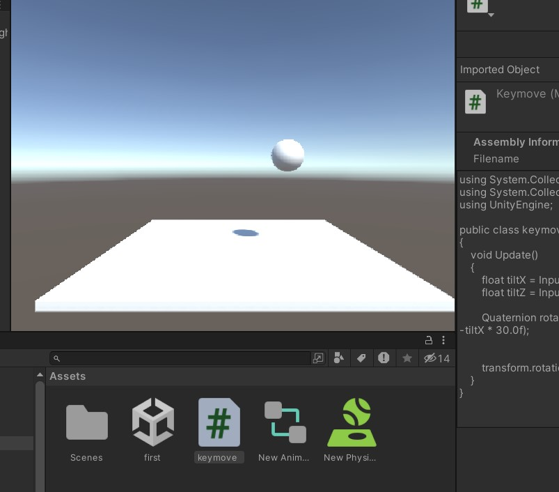
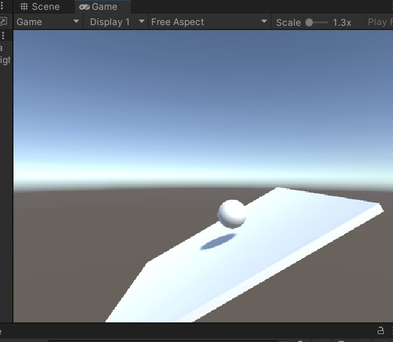
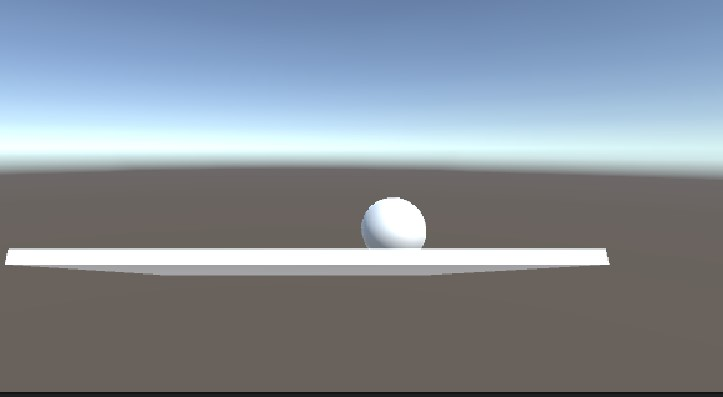

## 제공된 pdf를 따라 공과 판을 만들어 공이 판에서 떨어지면 튕기게 만드는 유니티 프로그램이다.
[]
## C# 스크립트를 이용해 방향키 입력으로 판을 기울일수 있게 만들었다.
[]
## 시작은 판은 바닥과 수평을 이루고 공이 떨어진다.
[]
## 방향키 이동에 따라 판이 기울어지는 것을 볼수있다.
[]
[]
----------------------------------------------------------------------------------

