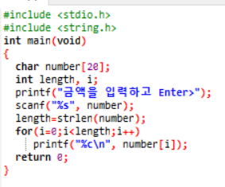
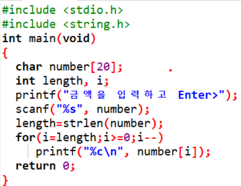
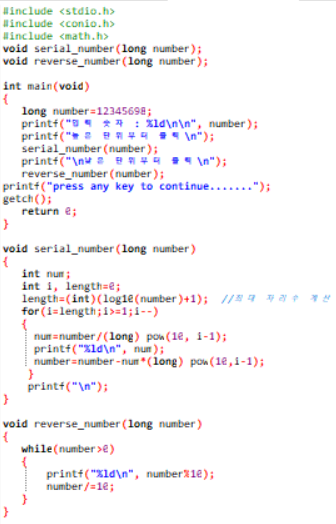
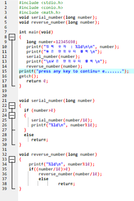
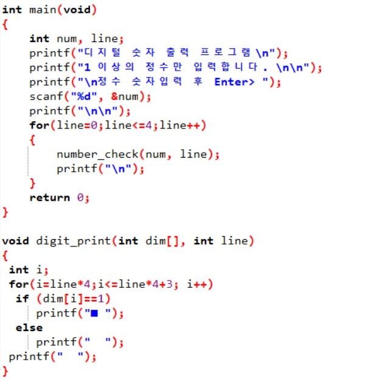
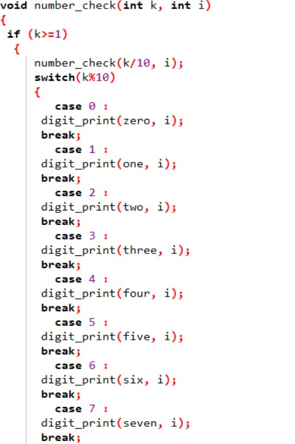
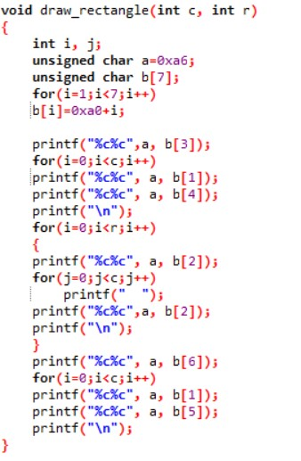
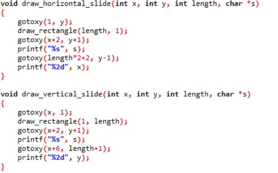
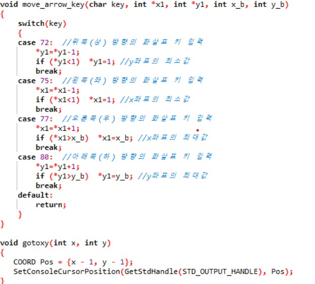

## 입력받은 금액을 자리마다 한 자리수로 표현
[]

## 입력받은 금액을 자리마다 한 자리수로 표현하는데 역순 출력
[]

## 제시된 정수를 높은 자리순 먼저 출력하는 것과 그에 대한 역순출력
[]

## 제시된 정수를 높은 자리순 먼저 출력하는 것과 그에 대한 역순출력
[]

## 숫자에 해당하는 모양을 미리 배열로 만들어 놓고 case로 값을 받아 해당하는 4*5배열에서 1인 부분만 ■출력하게 만들어서 디지털 숫자로 보이게함.
[] [] []

## 반복문을 이용해서 입력받은 크기만큼 슬라이드 바를 생성한다. case로 키보드의 입력을 받아서 수평슬라이드 바에 좌우 이동을, 수직슬라이드 바에는 위아래이동을 가능하게 한것.
[] [] []

