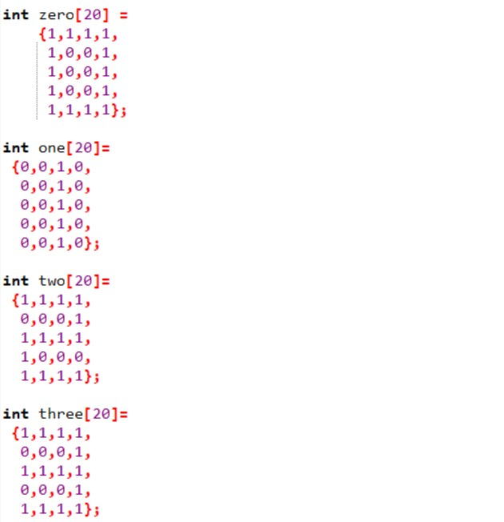

## 입력받은 금액을 자리마다 한 자리수로 표현
[]

## 입력받은 금액을 자리마다 한 자리수로 표현하는데 역순 출력
[]

## 제시된 정수를 높은 자리순 먼저 출력하는 것과 그에 대한 역순출력
[]

## 제시된 정수를 높은 자리순 먼저 출력하는 것과 그에 대한 역순출력
[]

## 숫자에 해당하는 모양을 미리 배열로 만들어 놓고 case로 값을 받아 해당하는 4*5배열에서 1인 부분만 ■출력하게 만들어서 디지털 숫자로 보이게함.
[] [] []

## 입력받은 수평, 수직 슬라이드바를 만들고 키보드 입력에 맞는 아스키 코드값을 case에 설정해 두고 왼쪽 오른쪽 위 아래로 움직이게 함.
