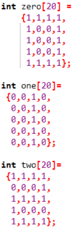
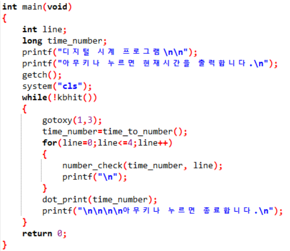
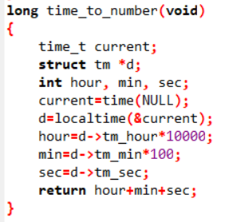
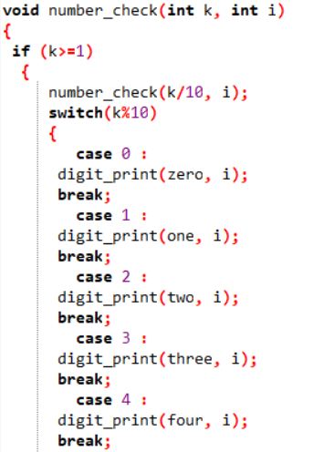
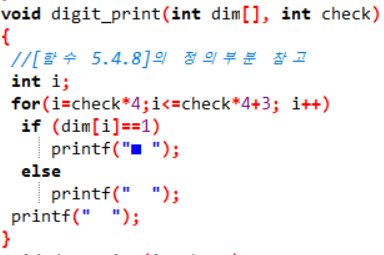
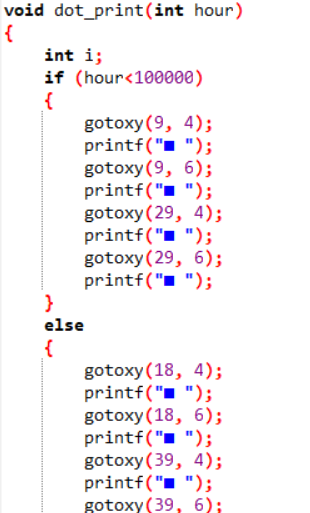
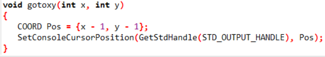

## 해당되는 숫자모양이 되게 0,1을구분해서 배열로 만들어 둔다.
[]

## 메인으로 시간을 받아서 해당되는 좌표에 시간을 출력한다.
[]

## 시간을 초시간으로 받고 초시간을 지역시간으로 바꾸어서 시,분,초로 나타내게함.
[]

## 해당되는 자릿수의 시간이 무슨 숫자인지 판단하고 해당되는 모양 배열 출력
[]

## 배열을 입력받아 1에 해당되는 부분을 ㅁ로 바꾸어서 숫자를 표현하게함.
[]

## 시 분 초를 구분하기 위한 점 출력.
[]

## 커서를 원하는 좌표로 이동시켜줌.
[]

