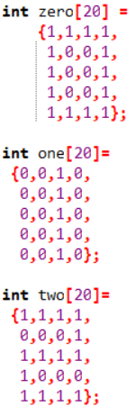
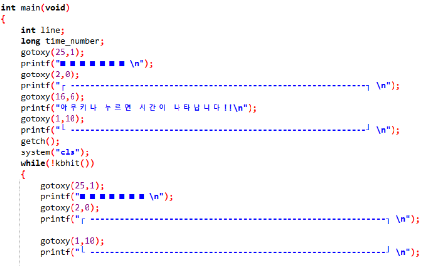
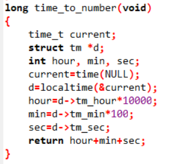
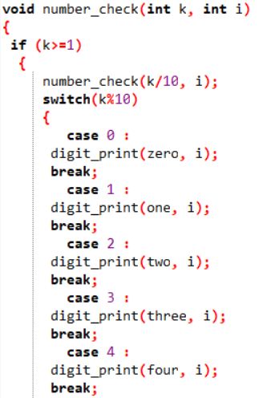
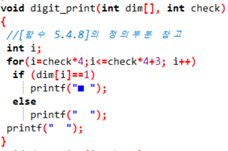
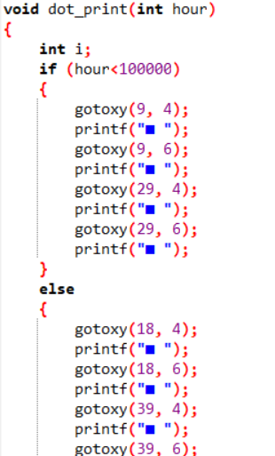
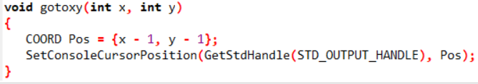
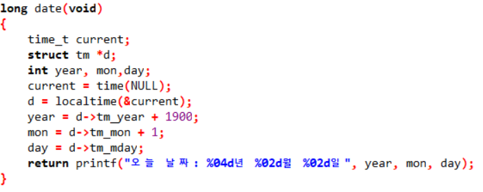
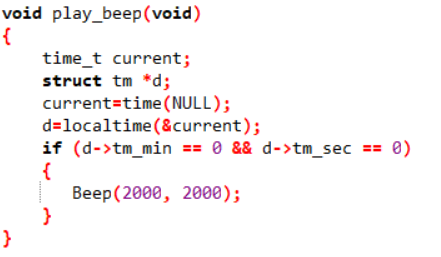

## 기존의 숫자 배열.
[]

## 기존의 코드에서 인터페이스를 변경함.
[]

## 시간을 시, 분, 초로 바꿔줌
[]

## 무슨 숫자인지 보고 배열 불러옴
[]

## 불러온 배열에서 1을 ㅁ모양으로 바꿔줌
[]

## 시 분 초를 구분하는 ㅁ출력
[]

## 커서 위치를 이동시켜주는 함수
[]

## 시간을 입력받아서 날짜로 바꿔주는 date 만듬
[]

## 정각시간이되면 소리가 나게 수정
[]
