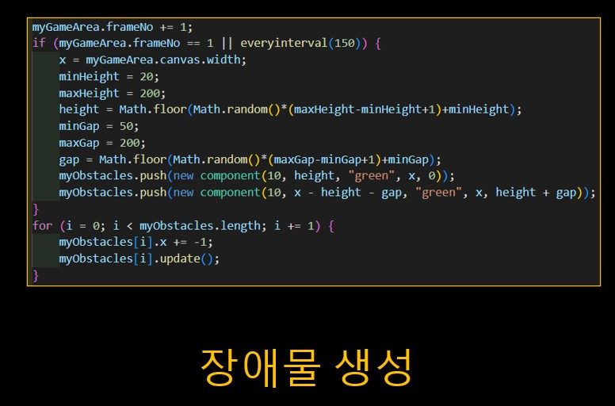

## 이게임은 HTML로만 구현한 버튼을 이용해 상하좌우를 이동하며 장애물을 피하는 게임이다.
[]
## 먼저 canvas( )를 이용해 게임이 나올 공간을 할당해 준다.
[]
## 게임이 시작할때 사용자가 움직일수 있는 개체를 생성해주고 개체는 30x30짜리 사각형이며 (10,120)에 위치 시키고 빨간색으로 만든다.
[]
## 계속 디스플레이를 지웠다 생성되게 하여 개체가 움직임에 있어 사용자에게 부드럽게 연출시켜준다.
[]
## 버튼을 만들어 상하좌우로 이동이 가능하게 만든다.
[]
## 조건을 만들어 장애물을 생성할때를 정하고 크기와 위 아래 장애물간 간격을 정해준다. 배열에 저장된 장애물들은 1의 속도로 간격을 가지고 나온게 된다.
[]
## 점수를 생성해준다. 점수의 색과 문구, 위치를 정해야한다. 그리고 점수는 FramNo에 따라 증가하게 만들어 준다. 그리고 update를 통해 점수 상승도 부드럽게 연출한다.
[]
